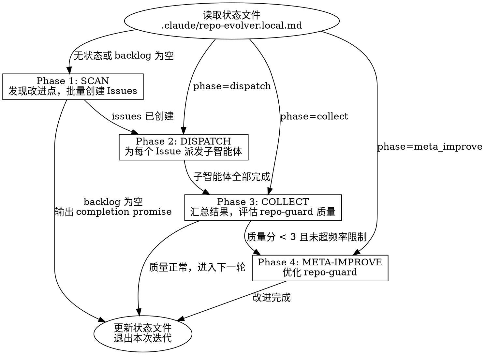

# Repo Evolver

自主仓库改进循环。读取状态文件，执行当前阶段，推进状态机，每次迭代完成一个改进。

<HARD-GATE>
在创建 GitHub Issue 并等待 repo-guard 评论之前，禁止修改任何项目代码文件。
在 Issue 创建并评估 repo-guard 反馈之前，禁止创建分支、编写方案或执行实现。
违反此规则等同于跳过测试直接提交——无论改进多么"显而易见"，都必须走完整流程。
</HARD-GATE>

## 红线

- 不经过 Issue 直接修改代码 → 违规。立即停止，回退到 Phase 1。
- 不等 repo-guard 评论就开始实现 → 违规。必须轮询等待或超时后才能继续。
- 跳过 PR 直接 commit 到默认分支 → 违规。所有变更必须通过 PR。
- "这个改动太小不需要走流程" → 不存在这种例外。所有改动走完整五阶段。

## 触发信号

- "审视这个仓库并持续改进"
- "自主发现和修复问题"
- "evolve this repo"
- 被 ralph-loop 重复喂入时自动恢复执行

不适用于：单次代码评审、手动指定的 bugfix、不涉及 GitHub 的本地修改。

## 状态机



## 工作流程

### 启动

1. 读取 `references/state-schema.md` 了解状态文件格式。
2. 读取 `.claude/repo-evolver.local.md`。如果不存在，创建初始状态（phase: scan, backlog: []）。
3. 根据当前 phase 跳转到对应阶段。

### 执行模型

**每次调用只执行当前 phase，完成后更新状态文件并退出。** 不要在一次调用中连续执行多个 phase。

- ralph-loop 模式：stop-hook 会重新喂入 prompt，下次调用自动进入下一个 phase。
- 单次调用模式：执行完当前 phase 后停止，用户下次调用时继续。

这意味着：Phase 1 结束后退出，Phase 2 在下次调用时执行，以此类推。这确保每个 phase 之间有明确的状态持久化点，且 repo-guard 有时间产生评论。

### Phase 1: SCAN + ISSUE

**本阶段只允许读取项目文件和创建 GitHub Issues。禁止修改任何项目代码。**

1. 读取 `references/scan-rubric.md`。
2. 运行项目的 lint、typecheck、test 命令，收集 warnings 和 failures。
3. 使用 GitNexus 查询死代码、高复杂度函数、未使用导出。
4. grep TODO/FIXME/HACK，检查过时依赖。
5. 对每个发现按 scan-rubric 评分，写入 backlog（去重：不重复已有 issue 或已尝试过的改进）。
6. 如果 backlog 为空且无新发现，输出 `<promise>NO_MORE_IMPROVEMENTS</promise>` 终止循环。
7. 取 backlog 中得分最高的 N 个独立项（N = min(backlog 中互不冲突的项数, 5)）。
8. 为每个选中项用 `gh issue create` 创建 GitHub Issue。
9. 等待 repo-guard 的 issue review 评论（轮询每个 issue，最多等待 3 分钟）。
10. 读取 `references/quality-evaluation.md`，对 repo-guard 评论评分，将有价值建议记录为约束条件。
11. 设置 phase=dispatch，记录所有 issue 编号和约束条件，更新状态文件。**然后停止。**

**独立性判定**：两个改进项互不冲突 = 涉及不同文件或不同包。如果两个项涉及同一文件，只选优先级更高的那个。

### Phase 2: DISPATCH

**本阶段为每个 Issue 派发一个子智能体，每个子智能体在独立 worktree 中完成 plan → implement → PR → 处理 repo-guard 审评 的完整流程。**

1. 读取状态文件中的 issue 列表和约束条件。
2. 对每个 issue，使用 Agent tool 派发一个子智能体（`isolation: "worktree"`），prompt 包含：
   - Issue 编号和描述
   - repo-guard 的约束条件（如有）
   - 明确指令：创建分支 → 编写方案 → 实现 → 提 PR → 等待 repo-guard 审评 → 处理反馈 → 退出
   - **REQUIRED SUB-SKILL:** superpowers:writing-plans, superpowers:subagent-driven-development, superpowers:finishing-a-development-branch
3. 所有子智能体并行执行，互不干扰（worktree 隔离）。
4. 等待所有子智能体完成，收集每个的 PR 编号和 repo-guard 质量分。
5. 设置 phase=collect，记录所有 PR 编号和质量分，更新状态文件。**然后停止。**

**子智能体 prompt 模板：**

```
你负责解决 Issue #{number}: {title}

约束条件（来自 repo-guard issue review）：
{constraints}

执行步骤：
1. 创建分支 improve/{slug}
2. 使用 writing-plans 编写技术方案
3. 使用 subagent-driven-development 执行方案
4. 使用 finishing-a-development-branch 创建 PR（目标分支: {default_branch}）
5. 在 PR 描述中引用 Issue: "Closes #{number}"
6. 等待 repo-guard PR review 评论（轮询 gh api，最多 5 分钟，间隔 30 秒）
7. 对有效建议（具体、可操作）：实施修复，push 到同一分支
8. 对无效建议（误报、泛泛）：忽略
9. 确认 CI 通过（gh pr checks）。如果失败，修复并 push

完成后报告：PR 编号、repo-guard 质量评分（参考 quality-evaluation 标准）、是否采纳了建议。
```

**并行上限**：最多同时派发 5 个子智能体。超过时分批执行。

### Phase 3: COLLECT

**本阶段汇总子智能体结果，评估整体 repo-guard 质量。**

1. 读取所有子智能体报告的 PR 编号和质量分。
2. 将所有质量分记录到 quality_log。
3. 计算滚动平均质量分。如果 < 3 且距上次 meta-improve >= 5 次迭代：设置 phase=meta_improve。
4. 否则：标记所有改进完成，从 backlog 移除，设置 phase=scan（进入下一轮）。**然后停止。**

### Phase 4: META-IMPROVE

1. 读取 `references/meta-improvement-guide.md`。
2. 诊断 repo-guard 质量问题类别（误报多？遗漏多？泛泛？）。
3. 定位需要修改的文件（repo-guard 的 prompts、skills、或 extra-instructions）。
4. 在 repo-guard 仓库创建分支，实施改进，提 PR。
5. 记录 meta_improvement_count++，设置 phase=scan（进入下一轮扫描）。**然后停止。**

## 输出契约

本 skill 不产出面向用户的报告。所有产出写入：
- `.claude/repo-evolver.local.md`（状态文件）
- GitHub issues 和 PRs（通过 gh CLI）
- Git commits（通过 subagent-driven-development）

每次迭代结束时，状态文件必须反映：当前 phase、backlog、quality_log、iteration count。

## 防护边界

- 不直接合并 PR。所有变更必须通过 PR + CI。
- 不 force-push。不删除分支（除非是自己创建的已合并分支）。
- 不修改项目的 CLAUDE.md 或 .claude/settings。
- Meta-improvement 每 5 次迭代最多触发 1 次。超过限制时跳过 Phase 4，直接回到 Phase 1。
- 不重复尝试已失败的改进。如果某个 backlog 项连续失败 2 次，标记为 skipped 并记录原因。
- 如果 scan 阶段连续 3 次产出空 backlog，输出 completion promise 终止循环。
- 不创建超过 10 个未合并 PR。如果未合并 PR 数量 >= 10，暂停创建新 PR，优先处理已有 PR 的 review 反馈。
- 并行子智能体最多 5 个。超过时分批。
- 子智能体必须使用 worktree 隔离（`isolation: "worktree"`）。禁止多个子智能体在同一工作目录操作。
